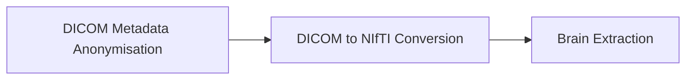

# Brain Anonymizer Pipeline
This is a Anonymization pipeline for brain MRI images.


## Techniques
- [KitwareMedical](http://kitware.eu/): [DicomAnonymizer](https://github.com/KitwareMedical/dicom-anonymizer)
- [NITRC](https://www.nitrc.org/): [DICOM to NIfTI converter](https://github.com/rordenlab/dcm2niix)
- [MIC-DKFZ](https://www.dkfz.de/en/mic/index.php): [HD-BET](https://github.com/MIC-DKFZ/HD-BET)


## Getting Started
### 1. System Requirements
- docker (resp. docker compose)

If you want to use GPU acceleration:
- NVIDIA GPU
- [NVIDIA runtime](https://docs.docker.com/config/containers/resource_constraints/#gpu)

### 2. How To Use
0. Build the containers (must be done only once): `docker compose build`

1. Copy your MRI data to the `input` directory. Be sure to use the right [directory structure](#directory-structure-io).

2. Run the pipeline.
    - GPU based: `docker compose up`
    - with GPU acceleration: `docker compose -f docker-compose_gpu.yml up`

3. The anonymised brain extracted mri images are found in the `output` directory.


## Directory Structure (I/O)

Be sure that each examination from a patient is exported in its respective folder **and possibly indicating the exam's modality / weighting**. For example, if an patient has a T1, a Flair and a T2 examinations the folder structure should be:

```bash
patient_id
|- t1_series
|  |- dicom_file1.dcm
|  |- dicom_file2.dcm
|  |- ...
|- flair_series
|  |- dicom_file1.dcm
|  |- dicom_file2.dcm
|  |- ...
|- t2_series
|  |- dicom_file1.dcm
|  |- dicom_file2.dcm
|  |- ...
```

